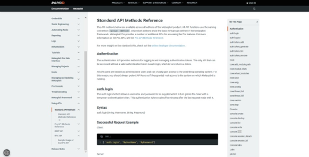
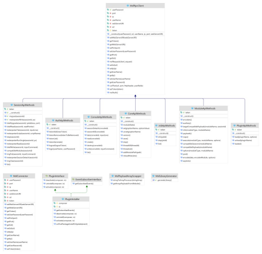
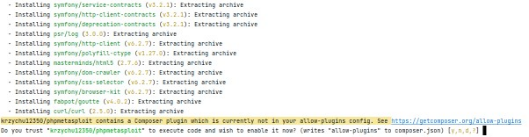
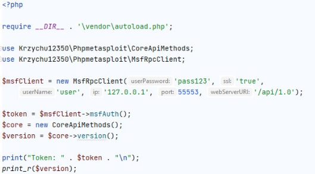
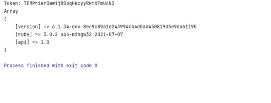

<h1 align="center">Php Metasploit Library</h1>
<p align="center">
	  <em>The PHP library whose code is automatically generated based on the Metasploit framework documentation.</em>
</p>

## Table of Contents
* [Documentation of standard methods](#documentation-of-standard-methods)
* [Class diagram](#class-diagram)
* [Prerequisites](#prerequisites)
* [Installing and running the library](#installing-and-running-the-library)
* [Run unit tests](#run-unit-tests)
* [License](#license)

## Documentation of standard methods
<p align="center">
    
</p>
<p align="center">
	  <a href="https://docs.rapid7.com/metasploit/standard-api-methods-reference/">Link to documentation</a>
</p>

## Class diagram
<p align="center">
    
</p>
<p align="center">
	  <em>Library class structure</em>
</p>

## Prerequisites
1. PHP 8.1.2 minimum
2. Composer 2.5.5 minimum

## Installing and running the library

### 1. Metasploit RPC server initialization

#### - via msgrpc plugin

To start the server through the msgrpc plugin, execute the following command in the Metasploit framework default console:

```bash
  load msgrpc 
```

The command has the following parameters:
- ServerHost - hostname on which the server is listening,
- ServerPort - port number on which the server is listening,
- User - user name that allows access to the server,
- Pass – server access password. It is required that the password is enclosed in quotation marks,
- SSL – enable or place SSL on the RPC socket. Select true enable SSL and false disable SSL.

An example command might be as follows:

```bash
  load msgrpc ServerHost=192.168.1.0 ServerPort=55553 User=user Pass='pass123'
```

#### - via msfrpcd demon

To start the RPC server through the msfrpcd daemon, launch the system terminal and then execute the following command:
```bash
  msfrpcd -P <password>
``` 
where <password> is the defined password for access to the server, this parameter is required

The above command has the following parameters:
- -a <value> – name of the host on which the server is listening,
- -p <value> – port number on which the server is listening,
- -U <value> – username that allows access to the server,
- -P <value> – access password to the server. The password must be enclosed in single quotes,
- -S – enable or disable SSL on the RPC socket. True enables SSL and false disables SSL,
- -f – adding this parameter starts the msfrpcd daemon in the background.

In each of the parameters, <value> means that the value of the parameter must be provided.

An example command might be as follows:

```bash
  ./msfrpcd -U user -P pass123 -a 127.0.0.1 -u /api/1.0 -p 55553 -f
```

### 2. Library installation
Before installation, make sure that the Composer package manager is installed in the operating system. 

Then run the following command to install the library:
```php
  composer require krzychu12350/phpmetasploit
```

During the library installation process, allow the library to dynamically generate the code by pressing the y key and then the key confirming the selection of this option.

<p align="center">
    
</p>

### 3. Launching the library

To start using the library, initialize the MsfRpcClient class object, and then call the msfAuth method to obtain the authentication token. 
As a result, you get a token that allow you to execute all functions available in the library.

<p align="center">
    
</p>

<p align="center">
    
</p>

## Run unit tests
To run unit tests launch the system terminal and go to root directory of the library and type in following command:
```php
  composer tests
```

## License
All Rights Reserved

Copyright (c) 2022 Krzysztof Karaś

Created by Krzysztof Karaś